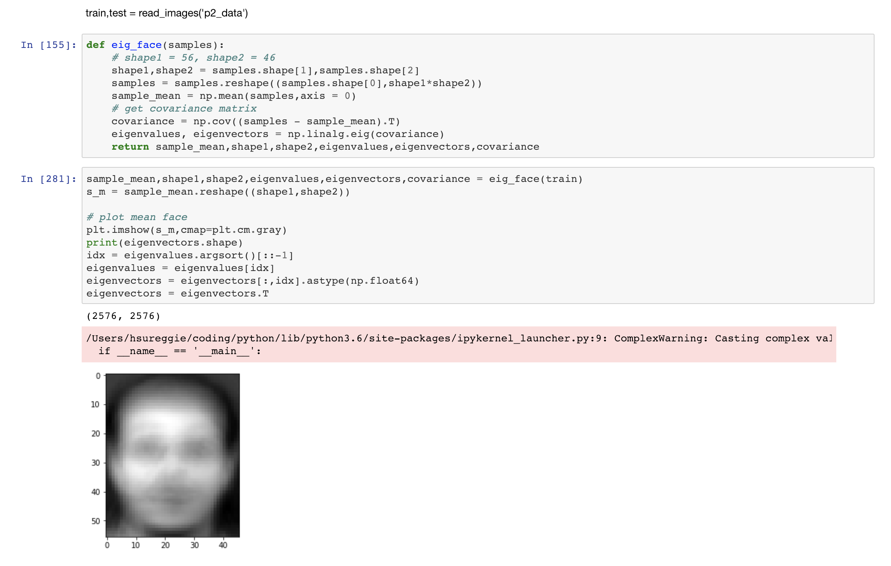
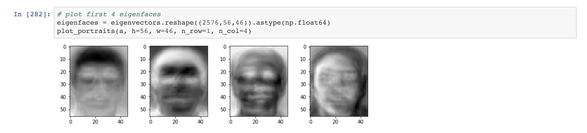
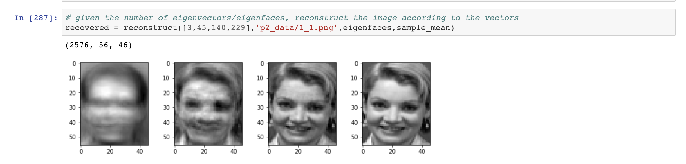

# PCA
This is a project I created in NTUEE's DLCV course to implement PCA on greyscaled human face images
## Viewing Source Code
To view the ```.ipynb``` source code, simply clone the repo or open it on nbviewer and provide the github link of the file:
https://nbviewer.jupyter.org/
## Resulting Images



